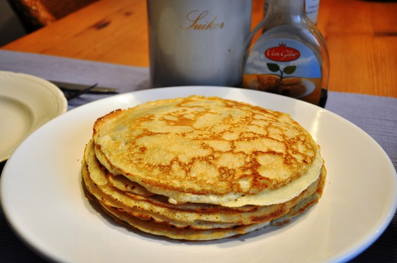

<<<<<<< HEAD
# les5
=======
"# Delicious Pancakes ??" 
# Delicious Pancakes 🥞

## BENODIGDHEDEN
- 1 cup flour
- 2 tablespoons sugar
- 2 teaspoons baking powder
- 1/2 teaspoon salt
- 1 egg
- 1 cup milk
- 2 tablespoons melted butter

### BEREIDING
1. Mix flour, sugar, baking powder, and salt in a bowl.
2. In another bowl, whisk egg, milk, and melted butter.
3. Combine the wet and dry ingredients until smooth.
4. Heat a non-stick pan over medium heat.
5. Pour 1/4 cup batter into the pan and cook until bubbles form.
6. Flip and cook until golden brown.
7. Serve with syrup and enjoy!

[Original Recipe](https://www.lekkerensimpel.com/basisrecept-voor-pannenkoeken/)
>>>>>>> a49e341 (Add recipe to README.md)
